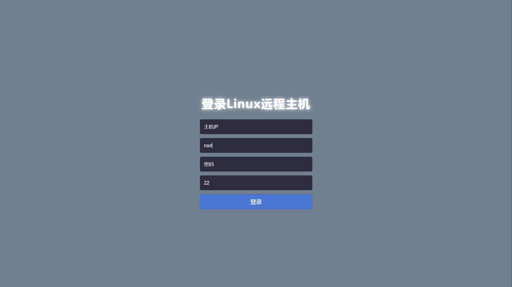
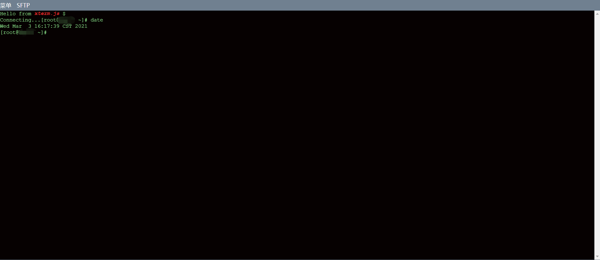
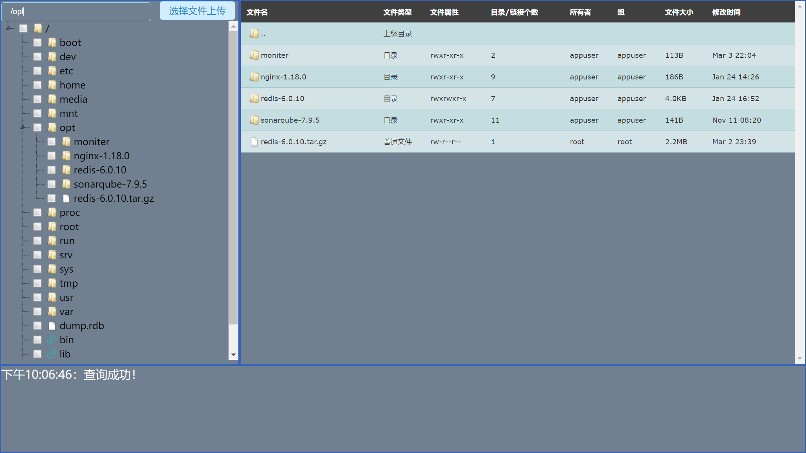

# web-shell [Github](https://github.com/zmzhou-star/web-shell)
[中文版](README.md)

#### Introduce
Pure Java implements a web shell login Linux remote host, technology selection SpringBoot + WebSocket + jsch + xterm.js

#### Software architecture description
* [Spring Boot](https://start.spring.io/)
* [Thymeleaf](https://docs.spring.io/spring-boot/docs/2.4.1/reference/htmlsingle/#boot-features-spring-mvc-template-engines)
* [WebSocket](https://docs.spring.io/spring-boot/docs/2.4.1/reference/htmlsingle/#boot-features-websockets)
* [jsch](https://github.com/is/jsch)
* [xterm.js](https://github.com/xtermjs/xterm.js/)
* Cache usage [spring cache](https://docs.spring.io/spring-boot/docs/2.4.1/reference/htmlsingle/#boot-features-caching-provider-ehcache2) + [ehcache](https://www.ehcache.org/)

#### Installation tutorial
1. `package`
```
mvn clean install -X -DskipTests
```
2. `run（Windows or Linux）`
```
java -jar -server web-shell-1.0.jar
```
The current ssh window is locked, you can press CTRL + C to interrupt the program running, or directly close the window, the program exits.

3. `run（Linux running in the background）`
```
nohup java -jar -server web-shell-1.0.jar > logs/web-shell.out 2>&1 &
```
nohup It means to run the command without hanging up, and the program will still run when the account is exited or the terminal is closed
&represents running in the background

4. `Address：`http://127.0.0.1:9598/


5. `instructions for use`
* sftp page file details list window double click the file to download
* On the sftp page, click the `Select File Upload` button to select file upload (multiple selections are possible)
   
#### Running effect chart




#### License
[The Apache-2.0 License](LICENSE)

Please feel free to enjoy and participate in open source

#### Donate
Open source is not easy, please encourage! (Note: If this project is helpful to you, please donate to show your support, thank you! Please note the web-shell donation and title for donation, thank you!)

| Alipay  | Wechat  |
| :------------: | :------------: |
|   |   |

#### Contact
email：<a href="mailto:zmzhou-star@foxmail.com">Contact zmzhou-star</a>

